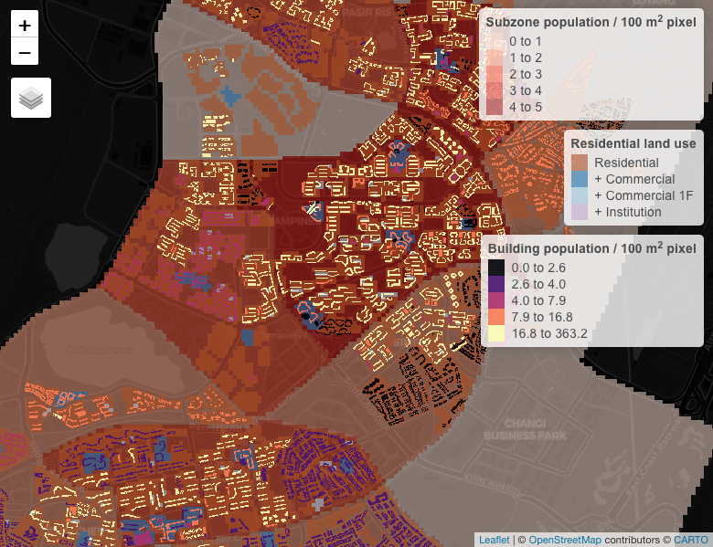
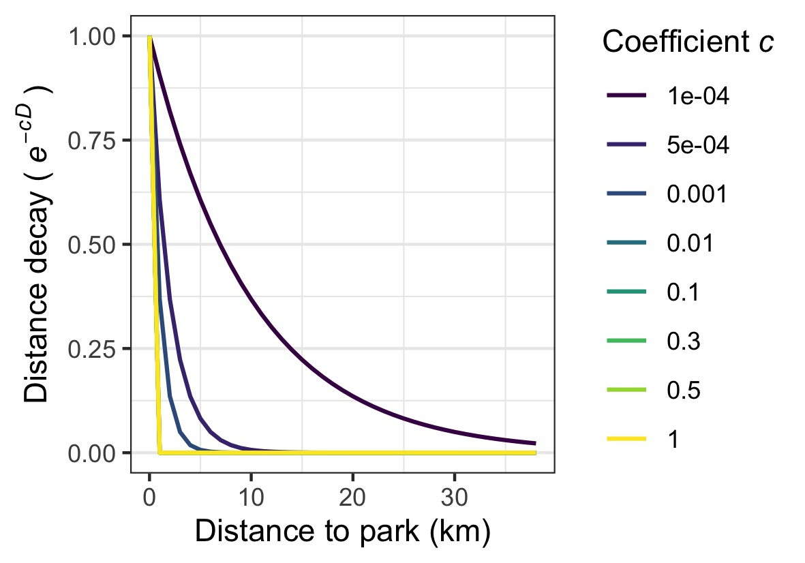
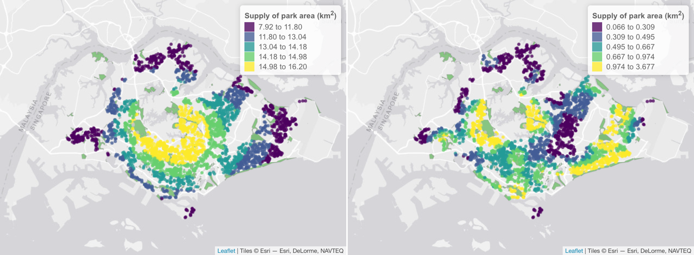
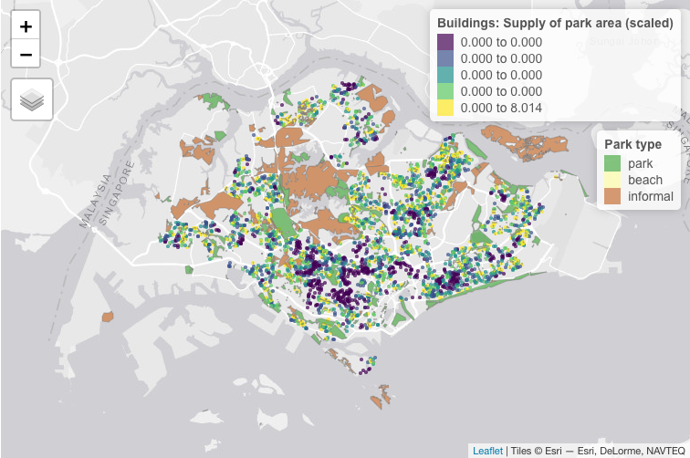

<!-- README.md is generated from README.Rmd. Please edit that file -->

# home2park: Spatial Provision of Urban Parks

<!-- badges: start -->

[](https://www.gnu.org/licenses/gpl-3.0)
[](https://www.tidyverse.org/lifecycle/#experimental)
[](https://github.com/ecological-cities/home2park/actions)
[](https://github.com/ecological-cities/home2park/actions)
[](https://zenodo.org/badge/latestdoi/321609762)
<!-- badges: end -->

<a href='https://ecological-cities.github.io/home2park/'></a>

`home2park` is an R package for assessing the spatial provision of urban
parks to residential buildings city-wide. Refer to the [package
website](https://ecological-cities.github.io/home2park/) for
demonstrations of how the package may be used.

## Installation

Install the development version of `home2park` from GitHub:

``` r
devtools::install_github("ecological-cities/home2park")
```

## Setup

Load the package:

``` r
library(home2park)
```

## Citation

To cite `home2park` or acknowledge its use, please cite the following:

*Song, X. P., Chong, K. Y. (2021). home2park: An R package to assess the
spatial provision of urban parks. Journal of Open Source Software,
6(64), 3609. <https://doi.org/10.21105/joss.03609>*

<br>

The get a BibTex entry, run `citation("home2park")`.

<br>

## Background

Parks are important spaces for recreation and leisure in cities.
Conventional measures of park provision tend to rely on summaries of
park area within a given region (e.g. per capita park area). However,
there is a need to characterise the wide variety of parks (e.g. nature
areas, gardens, waterfront parks, outdoor playgrounds, etc.) that serve
different groups of people. When planning at fine spatial scales, such
current metrics are also limited by their coarse spatial resolution and
the presence of artificial boundaries.

<br>

## Using home2park

The package `home2park` provides a way to measure *multiple aspects* of
park provision to homes, at the resolution of *individual buildings*.
The key features include the ability to:

-   Download relevant data from OpenStreetMap (OSM) such as buildings,
    parks and features related to recreation (alternatively, the user
    may use their own datasets).
-   Redistribute coarse-scale population data (e.g. per census unit
    region) into residential buildings, also known as ‘dasymetric
    mapping’.
-   Summarise multiple attributes that are important for recreation, at
    each park.
-   Calculate the supply (provision) of the park attributes to each
    residential building, while accounting for ‘distance decay’, or the
    fact that supply from parks further away are reduced.

The following sections provide a high-level overview of the various
steps required to measure the spatial provision of parks. Further
details and code examples can be found in the package vignette ‘[Get
started](articles/home2park.html)’.

### 1. Process city population

Residential buildings (homes) are an important component of the
analysis. These may be obtained, for example, by downloading building
polygons from OpenStreetMap (OSM), and subsetting the dataset to areas
within ‘residential’ land use zones.

In addition, having the population count per residential building allows
us to calculate the total spatial provision of parks to all residents,
and can help highlight important areas where more people will benefit
from the presence of parks. Coarse-scale population census data can be
redistributed into the residential buildings, via a technique known as
‘dasymetric mapping’. The number of building ‘levels’ from OSM can be
used as a proxy for population density (i.e. more residents per unit
area). Here’s an example screenshot showing an overlay of multiple
example datasets in the package (for the city of Singapore), which were
used to redistribute population data per census unit (subzones) across
residential buildings.

<div class="figure" style="text-align: center">


<p class="caption">
Example screenshot showing an overlay of multiple datasets used to
redistribute the population across buildings within residential land use
zones. The legends are ordered (top to bottom) by increasing spatial
resolution.
</p>

</div>

<br>

Residential building polygons in Singapore each with a population count
can be found in the following example dataset:

``` r
data(buildings_pop_sgp)
head(buildings_pop_sgp)
#> Simple feature collection with 6 features and 1 field
#> Geometry type: POLYGON
#> Dimension:     XY
#> Bounding box:  xmin: 103.8173 ymin: 1.460475 xmax: 103.8399 ymax: 1.46182
#> Geodetic CRS:  WGS 84
#>     popcount                       geometry
#> 1 218.885435 POLYGON ((103.8179 1.46182,...
#> 2  39.797352 POLYGON ((103.8173 1.461277...
#> 3   9.219688 POLYGON ((103.8375 1.461288...
#> 4   9.949338 POLYGON ((103.8176 1.461096...
#> 5  85.282118 POLYGON ((103.839 1.461289,...
#> 6 218.885435 POLYGON ((103.8176 1.461549...
```

<br>

### 2. Process parks

Parks are the other important component of the analysis. These may be
downloaded from OSM and processed using this package. The following
example dataset contains parks in Singapore with selected attributes
related to recreation/leisure:

``` r
data(parks_sgp)
head(parks_sgp[, 28:33]) # subset to relevant columns
#> Simple feature collection with 6 features and 6 fields
#> Geometry type: MULTIPOLYGON
#> Dimension:     XY
#> Bounding box:  xmin: 103.7809 ymin: 1.248586 xmax: 103.8704 ymax: 1.28586
#> Geodetic CRS:  WGS 84
#>               area     perimeter playground_count playground_ptdensity
#> 1   2454.365 [m^2]  346.5265 [m]                0            0 [1/m^2]
#> 2   1964.286 [m^2]  305.3844 [m]                0            0 [1/m^2]
#> 3 219319.203 [m^2] 3019.2241 [m]                0            0 [1/m^2]
#> 4  22513.834 [m^2]  615.1039 [m]                0            0 [1/m^2]
#> 5 571259.766 [m^2] 3973.5567 [m]                0            0 [1/m^2]
#> 6  67533.345 [m^2] 1092.2758 [m]                0            0 [1/m^2]
#>    trails_length trails_length_perim_ratio                       geometry
#> 1     0.0000 [m]             0.0000000 [1] MULTIPOLYGON (((103.8471 1....
#> 2     0.0000 [m]             0.0000000 [1] MULTIPOLYGON (((103.8446 1....
#> 3  4072.5481 [m]             1.3488724 [1] MULTIPOLYGON (((103.8059 1....
#> 4   837.9212 [m]             1.3622434 [1] MULTIPOLYGON (((103.8233 1....
#> 5 20947.6579 [m]             5.2717652 [1] MULTIPOLYGON (((103.8613 1....
#> 6   905.5080 [m]             0.8290105 [1] MULTIPOLYGON (((103.7812 1....
```

<br>

### 3. Recreation supply

With the processed building and park polygons, the provision of park
attributes per residential building can be calculated. The total supply
*S* of each park attribute to a building is calculated based on the
following equation. Its value depends on the distances between that
particular building and all parks; attributes from parks further away
are reduced as a result of the negative exponential function
*e<sup>-cd</sup>*, an effect also known as the ‘distance decay’ ([Rossi
et al., 2015](http://dx.doi.org/10.1016/j.apgeog.2015.06.008)).


where

-   *S* = Total supply of a specific park attribute to the building from
    parks *i*; *i* = 1,2,3, … *n* where *n* = total number of parks
    citywide.

-   *s*<sub>*i*</sub> = Supply of a specific park attribute from park
    *i*. A perfect positive linear association is assumed, since the
    focus is on supply metrics.

-   *d*<sub>*i*</sub> = Distance in kilometres from the building to park
    *i* (e.g. Euclidean, Manhattan, etc.).

-   *c* = Coefficient determining rate of decay in supply
    *s*<sub>*i*</sub> with increasing distance.

<br>

Note that the value of Coefficient *c* depends on both park and park
visitors’ attributes, such as socio-demographic factors and preferences
for activities that may impel shorter or longer travel ([Rossi et al.,
2015](http://dx.doi.org/10.1016/j.apgeog.2015.06.008); [Tu et
al.](https://doi.org/10.1016/j.ufug.2020.126689)). A lower value implies
that parks further away are accessible or frequently visited by
residents (i.e. still contributes to the ‘recreation supply’ of a
particular building).

<div class="figure" style="text-align: center">


<p class="caption">
Figure: The value of Coefficient c and its effect on the distance decay
between a building and park.
</p>

</div>

<br>

<div class="figure" style="text-align: center">


<p class="caption">
Screenshot: Examples showing the supply of OSM park area to residential
buildings in Singapore for the year 2020 when the value of Coefficient c
is 0.1 (left panel) and 1 (right panel). Each building is denoted as a
point (a random subset is shown); the color palette is binned according
to quantile values.
</p>

</div>

<br>

To calculate the supply of each park attribute, we first calculate the
pairwise distances between all buildings and parks (a distance matrix).
This output is supplied to the function `recre_supply()`. For example,
we can calculate the supply of park *area* to each building. This supply
value can then be multiplied by the population count per building, to
obtain the total supply to all residents.

``` r
# transform buildings & parks to projected crs
buildings_pop_sgp <- sf::st_transform(buildings_pop_sgp, sf::st_crs(32648))
parks_sgp <- sf::st_transform(parks_sgp, sf::st_crs(32648))


# convert buildings to points (centroids), then calculate distances to every park
m_dist <- buildings_pop_sgp %>%
  sf::st_centroid() %>%
  sf::st_distance(parks_sgp) %>% # euclidean distance
    units::set_units(NULL)

m_dist <- m_dist / 1000 # convert distances to km


# new column for the supply of park area
buildings_pop_sgp$area_supply <- recre_supply(park_attribute = parks_sgp$area, 
                                              dist_matrix = m_dist, 
                                              c = 0.302) # e.g. from Tu et al. (2020)

# supply to all residents per building
buildings_pop_sgp$area_supplytopop <- buildings_pop_sgp$area_supply * buildings_pop_sgp$popcount
```

<div class="figure" style="text-align: center">


<p class="caption">
Screenshot: Supply of park area to building residents in Singapore based
on OSM data (2020). Each building is denoted as a point (a random subset
is shown). The value for Coefficient c was set at 0.302. The color
palette is binned according to quantile values.
</p>

</div>

<br>

## Data sources

-   Singapore census data from the [Department of Statistics
    Singapore](https://www.singstat.gov.sg/find-data/search-by-theme/population/geographic-distribution/latest-data).
    Released under the terms of the [Singapore Open Data Licence version
    1.0](https://data.gov.sg/open-data-licence).

-   Singapore subzone polygons from the [Singapore Master Plan
    Subzones](https://data.gov.sg/dataset/master-plan-2019-subzone-boundary-no-sea).
    Released under the terms of the [Singapore Open Data Licence version
    1.0](https://data.gov.sg/open-data-licence).

-   Singapore Master Plan Land Use Zones for the years
    [2014](https://data.gov.sg/dataset/master-plan-2014-land-use) and
    [2019](https://data.gov.sg/dataset/master-plan-2019-land-use-layer).
    Released under the terms of the [Singapore Open Data
    License](https://data.gov.sg/open-data-licence).

-   Building polygons derived from map data
    [copyrighted](https://www.openstreetmap.org/copyright) OpenStreetMap
    contributors and available from <https://www.openstreetmap.org>.
    Released under the terms of the [ODbL
    License](https://opendatacommons.org/licenses/odbl/summary/).

-   Park polygons and summarised attributes (trails, playgrounds)
    derived from map data
    [copyrighted](https://www.openstreetmap.org/copyright) OpenStreetMap
    contributors and available from <https://www.openstreetmap.org>.
    Released under the terms of the [ODbL
    License](https://opendatacommons.org/licenses/odbl/summary/).

<br>

## References

Rossi, S. D., Byrne, J. A., & Pickering, C. M. (2015). The role of
distance in peri-urban national park use: Who visits them and how far do
they travel?. Applied Geography, 63, 77-88.

Tu, X., Huang, G., Wu, J., & Guo, X. (2020). How do travel distance and
park size influence urban park visits?. Urban Forestry & Urban Greening,
52, 126689.
