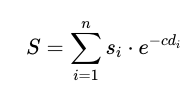

```{r, include = FALSE}
knitr::opts_chunk$set(
  collapse = TRUE,
  comment = "#>"
)
```

## Overview

Parks are important spaces for recreation and leisure in cities. Conventional metrics that measure the provision of parks to city residents usually summarise the park area within a given region (e.g. per capita park area). However, 
there is a need to characterise the wide variety of parks (e.g. nature areas, gardens, waterfront parks, outdoor playgrounds, etc.) that serve different groups of people. When planning at fine spatial scales, such metrics are also limited by their coarse spatial resolution and the presence of artificial boundaries.

The package `home2park` provides a way to measure _multiple aspects_ of park provision to homes, at the resolution of _individual buildings_. The key features include the ability to:

- Download relevant data from OpenStreetMap (OSM), e.g., buildings, parks and features related to recreation/leisure (alternatively, the user may use their own datasets).
- Redistribute coarse-scale population data (per census block region) into residential buildings, also known as 'dasymetric mapping'.
- Summarise multiple attributes that are important for recreation/leisure, at each park.
- Calculate the supply (provision) of the park attributes to each residential building, while accounting for 'distance decay', or the fact that supply from parks further away are reduced.

## Installation

Install the development version of `home2park` from GitHub:

```{r, eval = FALSE}
devtools::install_github("ecological-cities/home2park")
```

## Setup

Load the package:

```{r eval = TRUE}
library(home2park)
```

```{r include = FALSE, eval = FALSE}
devtools::load_all() # to knit manually
```

<br>

## 1. Process city population

The first step is to process data related to the residential population (e.g. population census counts, residential buildings), in order to get the population count per building. The package comes with example data from the city of Singapore. This includes [population counts](https://www.singstat.gov.sg/find-data/search-by-theme/population/geographic-distribution/latest-data) per [census block](https://data.gov.sg/dataset/master-plan-2019-subzone-boundary-no-sea) in the years 2018 and 2020, and land use zones based on the Master Plan released in the years [2014](https://data.gov.sg/dataset/master-plan-2014-land-use) and [2019](https://data.gov.sg/dataset/master-plan-2019-land-use-layer). To get the residential buildings for the population census conducted in 2020, we can download building polygons from OpenStreetMap on 2021-01-01, and subset them to areas within 'residential' land use zones in the 2019 Master Plan. The processed polygons can then be rasterised in preparation for dasymetric mapping.

```{r load data, eval = FALSE}

data(pop_sgp) # population count per census block (years 2018 & 2020)

# merge all census blocks for chosen year (2020) into single multi-polygon 
# next function requires that polygons are merged
city_boundaries <- pop_sgp %>%
    dplyr::filter(year == 2020) %>%
    sf::st_union() %>% 
    sf::st_as_sf() %>%
    smoothr::fill_holes(threshold = units::set_units(1, "km^2"))  %>% # clean up
    smoothr::drop_crumbs(threshold = units::set_units(1, "km^2"))  %>%
    sf::st_make_valid()


# get buildings from OpenStreetMap (use closest matching archive date)
# raw data saved in tempdir() unless otherwise specified
buildings <- get_buildings_osm(place = city_boundaries,
                               date = as.Date(c("2021-01-01"))) %>%
  dplyr::mutate(year = 2020)


# rasterise population - specify relevant column names
pop_rasters <- rasterise_pop(pop_sgp,
                             census_block = "subzone_n",
                             pop_count = "pop_count",
                             year = "year")


# rasterise land use - specify relevant column names and residential land use classes
data(landuse_sgp) 
landuse_rasters <- rasterise_landuse(landuse_sgp,
                                     land_use = 'lu_desc',
                                     subset = c('1' = 'RESIDENTIAL',
                                                '2' = 'COMMERCIAL & RESIDENTIAL',
                                                '3' = 'RESIDENTIAL WITH COMMERCIAL AT 1ST STOREY',
                                                '4' = 'RESIDENTIAL / INSTITUTION'),
                                     sf_pop = pop_sgp)


# rasterise buildings - specify relevant column names
# the column 'levels' is a proxy for how densely populated the building can be (i.e. more residents per unit area)
buildings_rasters <- rasterise_buildings(buildings,
                                         proxy_pop_density = 'levels',
                                         year = 'year',
                                         sf_pop = pop_sgp,
                                         sf_landuse = landuse_sgp)

```

Next, perform dasymetric mapping to redistribute the population counts per census block region (year 2020) into the residential buildings. The number of building 'levels' from OSM can be used as a proxy for population density (i.e. more residents per unit area).  

```{r dasymetric mapping, eval = FALSE}

# list element 2 is for the year 2020
popdens_raster <- pop_dasymap(pop_polygons = pop_rasters$pop_polygons[[2]],
                               pop_perblock_count = pop_rasters$pop_count[[2]],
                               pop_perblock_density = pop_rasters$pop_density[[2]],
                               land_relative_density = buildings_rasters[[2]])

```

<br>

Here's a screenshot showing an overlay of the multiple datasets used to redistribute the population data per census block (subzones) across residential buildings. 

```{r, echo=FALSE, fig.align = "center", out.width="80%", fig.cap = paste0("Screenshot: Residential population in Singapore redistributed across buildings within residential land use zones. The legends are ordered (top to bottom) by increasing spatial resolution.")}
knitr::include_graphics("../man/figures/README-dasymetric-mapping.png")
```

<br>

Finally, we can convert this raster to building polygons each with a population count. Note that this is provided as an example dataset `data(buildings_pop_sgp)` in this package.

```{r eval = FALSE}
buildings_pop_sgp <- pop_density_polygonise(input_raster = popdens_raster)

head(buildings_pop_sgp)
```

```{r echo = FALSE}
data(buildings_pop_sgp)
head(buildings_pop_sgp)
```

<br>

## 2. Process parks

The example dataset `data(parks_sgp)` contains parks in Singapore and selected attributes related to recreation/leisure (downloaded from OSM on 2021-01-01). This was downloaded and processed as follows. Parks within other cities (provided polygon boundaries) can be downloaded and processed in a similar manner.

```{r get park and their attributes, eval = FALSE}

# get park polygons
parks_sgp <- get_parks_osm(city_boundaries,
                           date = as.Date(c("2021-01-01")))


# get playground points
playgrounds <- get_playgrounds_osm(place = city_boundaries,
                                   date = as.Date(c("2021-01-01")))

# get trail lines
trails <- get_trails_osm(place = city_boundaries,
                         date = as.Date(c("2021-01-01")))


# convert to lists
point_list <- list(playgrounds) # calculation of attributes requires input to be named list 
names(point_list) <- c("playground")

line_list <- list(trails)
names(line_list) <- c("trails")


# per park, calculate point count/density & line length/ratio 
parks_sgp <- parks_calc_attributes(parks = parks_sgp, 
                                   data_points = point_list,
                                   data_lines = line_list,
                                   relative = TRUE)

head(parks_sgp[, 28:33]) # view park attributes
```

```{r echo = FALSE}
data(parks_sgp)
head(parks_sgp[, 28:33])
```

<br>

## 3. Recreation supply

The processed data can now be used to calculate the provision of park attributes per residential building. The total supply $S$ of each park attribute to a building is calculated based on the following equation. Its value depends on the distances between that particular building and all parks; attributes from parks further away are generally reduced as a result of the negative exponential function _e<sup>-cd</sup>_, an effect also known as the 'distance decay' ([Rossi et al., 2015](http://dx.doi.org/10.1016/j.apgeog.2015.06.008)).

```{r, echo=FALSE, fig.align = "center", out.width="18%"}

```

where  

- $S$ = Total supply of a specific park attribute to the building from parks $i$; $i$ = 1,2,3, ... $n$ where $n$ = total number of parks citywide.

- $s_{i}$ = Supply of a specific park attribute from park $i$. A perfect positive linear association is assumed, since the focus is on supply metrics. If park area has been calculated as an attribute, other attributes may be calculated as relative amounts (e.g. point density, ratio of line-to-perimeter length, proportional area) to avoid double-counting the effect of park size.

- $d_{i}$ = Euclidean distance from the building to park $i$.

- $c$ = Coefficient determining rate of decay in supply $s_{i}$ with increasing distance. 

<br>

The value of coefficient $c$ depends on both park and park visitors' attributes, such as socio-demographic factors and preferences for activities that may impel shorter or longer travel ([Rossi et al., 2015](http://dx.doi.org/10.1016/j.apgeog.2015.06.008)). For example, (non-Euclidean) distance decay in the ratio of visitors at urban parks in Beijing in [Tu et al. (2020)](https://doi.org/10.1016/j.ufug.2020.126689) fit the negative exponential curve _e<sup>-cd</sup>_, with coefficient $c$ empirically determined as _0.302_. Empirical cut-off distances were 1–2km where most (> 50%) people would visit a park and 5–10km beyond which few (< 5%) people would visit a park. 


```{r, echo=FALSE, fig.align = "center", out.width="50%", fig.cap = paste0("Figure: The effect of Coefficient c and its effect on the distance decay between a building and park.")}
knitr::include_graphics("../man/figures/README-c-sensitivity.png")
```

<br> 

```{r, echo=FALSE, fig.align = "center", out.width="100%", fig.cap = paste0("Screenshot: The supply of park area to residential buildings in Singapore when the value of Coefficient c is 0.0001 (left panel) and 0.01 (right panel). Singapore measures approximately 50 km east to west, and the largest parks/nature areas tend to be centrally located. The color palette for the buildings (points) are binned according to their quantile values.")}
knitr::include_graphics("../man/figures/README-c-sensitivity-map.png")
```


<br>

To calculate the supply of each park attribute, we first calculate the pairwise distances between all buildings and parks (a distance matrix). This is supplied to the function `recre_supply()`. For example, we can calculate the supply of park _area_ to each building. This supply value can then be multiplied by the population count per building, to obtain the total supply to all residents. This can help highlight important areas where more people would benefit from the presence of parks. 

```{r calc distance matrix and supply of park area, message = FALSE, warning = FALSE}

# convert buildings to points (centroids), then calculate distances to every park
m_dist <- buildings_pop_sgp %>%
  sf::st_centroid() %>%
  sf::st_distance(parks_sgp) %>%
    units::set_units(NULL)


# new column for the supply of park area
buildings_pop_sgp$area_supply <- recre_supply(park_attribute = parks_sgp$area, 
                                              dist_matrix = m_dist, 
                                              c = 0.302) # e.g. from Tu et al. (2020)

# supply to all residents per building
buildings_pop_sgp$area_supplytopop <- buildings_pop_sgp$area_supply * buildings_pop_sgp$popcount


# scale the supply variables if necessary
buildings_pop_sgp <- buildings_pop_sgp %>%
    dplyr::mutate(across(.cols = c(area_supply, area_supplytopop), 
                         ~(scale(., center = FALSE))))

```

```{r include = FALSE}
rm(m_dist)
```

<br>

Finally, it is also possible to summarise the supply values of buildings within coarser spatial regions (e.g. census blocks). This allows us to compare our results with conventional park provision metrics (per capita park area) for the selected year 2020.

```{r echo = FALSE}
data(pop_sgp)
```

```{r}
# calculate for year 2020
pop_2020 <- pop_sgp %>%
  dplyr::filter(year == 2020)
```

Calculate summary statistics (e.g. sum, median, mean) for the supply of park area within each census block region:

```{r summarise supply of park area per census block, message = FALSE}

# append subzone info to buildings if building intersects with subzone  
buildings_subzones <- buildings_pop_sgp  %>%
  sf::st_join(pop_2020,
              join = sf::st_intersects,
              left = TRUE) %>%
  sf::st_set_geometry(NULL)


# summarise total/median/average supply value for all buildings within subzone
buildings_subzones <- buildings_subzones %>%
  dplyr::group_by(subzone_n) %>%
  dplyr::summarise(across(.cols = c(area_supply, area_supplytopop), 
                          .fns = sum, .names = "{.col}_sum"),
                   across(.cols = c(area_supply, area_supplytopop), 
                          .fns = median, .names = "{.col}_median"),
                   across(.cols = c(area_supply, area_supplytopop), 
                          .fns = mean, .names = "{.col}_mean")) 
  

# join information to pop_2020, calculate supply per capita
pop_2020 <- pop_2020 %>%
  dplyr::left_join(buildings_subzones) %>%
  dplyr::mutate(area_supplyperpop = area_supplytopop_sum / pop_count) %>%
  dplyr::mutate(area_supplyperpop = ifelse(is.infinite(area_supplyperpop), NA, area_supplyperpop)) # make infinite NA

```

Calculate the per capita park area for each census block:

```{r conventional park provision metric - per capita park area, message = FALSE, warning = FALSE}

subzones_parks <- sf::st_intersection(pop_2020, parks_sgp) # subset census block polygons to those that intersect parks, append park info
subzones_parks$parkarea_m2 <- sf::st_area(subzones_parks) # calc area of each polygon


# calculate total park area per census block
subzones_parks <- subzones_parks %>%
  dplyr::group_by(subzone_n) %>%
  dplyr::summarise(parkarea_m2 = as.numeric(sum(parkarea_m2))) %>%
  sf::st_drop_geometry()


# join information to pop_2020, calculate park area per capita
pop_2020 <- pop_2020 %>%
  dplyr::left_join(subzones_parks) %>%
  dplyr::mutate(parkarea_m2 = ifelse(is.na(parkarea_m2), 0, parkarea_m2)) %>% # make NA 0
  dplyr::mutate(parkperpop_m2 = parkarea_m2 / pop_count) %>%
  dplyr::mutate(parkperpop_m2 = ifelse(is.infinite(parkperpop_m2), # make infinite NA
                                NA, parkperpop_m2)) %>%
  dplyr::mutate(parkperpop_m2 = ifelse(is.nan(parkperpop_m2), # make NaN NA
                                NA, parkperpop_m2))

```

```{r include = FALSE}
rm(buildings_subzones, subzones_parks)
```

<br>

The following map provides a visual comparison between the metrics that were calculated.

```{r  plot park metrics on map, echo = FALSE, message = FALSE, warning = FALSE, dpi = 300, fig.height = 2.0, fig.width = 2.35, fig.cap=paste0("Map: Supply of park area in Singapore based on OSM data (2020). Only a randomly sampled subset of building polygons are shown. All color palettes were binned according to their quantile values.")}

# convert buildings to points (centroids) for plotting
buildings_pop_sgp <- buildings_pop_sgp %>% 
  sf::st_centroid() %>%
  dplyr::mutate(across(everything(), as.vector)) # remove attributes from columns for plotting


tmap::tmap_mode("view")

tm <- 
  tmap::tm_basemap(c("Esri.WorldGrayCanvas", "CartoDB.DarkMatter", "OpenStreetMap")) +

  # census blocks
  tmap::tm_shape(pop_2020) +
    tmap::tm_polygons(title = "Park area per capita (Ha/1000 residents)",
                      group = "Census blocks: Per capita park area (conventional)",
                      col = "parkperpop_m2",
                      palette = "Greens", alpha = 0.7,
                      style = "quantile",
                      border.col = "white", border.alpha = 0.5, lwd = 1) +
  tmap::tm_shape(pop_2020) +
    tmap::tm_polygons(title = "Supply of park area per capita (scaled)",
                      group = "Census blocks: Per capita supply of park area",
                      col = "area_supplyperpop", 
                      palette = "Greens", alpha = 0.7,
                      style = "quantile",
                      border.col = "white", border.alpha = 0.5, lwd = 1) +
          
  # buildings
  tmap::tm_shape(dplyr::slice_sample(buildings_pop_sgp, # subset random sample
                                     n = nrow(buildings_pop_sgp)/12)) +
    tmap::tm_dots(title = "Supply of park area (scaled)",
                  group = "Buildings: Supply of park area to residents",
                  col = "area_supplytopop", border.col = "transparent",
                  palette = viridis::viridis(5),
                  style = "quantile",
                  size = 0.01,
                  alpha = 0.7) +
  
  # parks  
  tmap::tm_shape(parks_sgp %>% dplyr::select(id, name, area)) +
    tmap::tm_polygons(group = "Parks",
                      col = "#33a02c",
                      alpha = 0.6,
                      border.col = "grey50",  border.alpha = 0.5)
  
  
# Pipe the tmap object into tmap_leaflet() to create a leaflet widget,
# so that we can use leaflet::hideGroup().
tm %>% 
  tmap::tmap_leaflet() %>%
  leaflet::hideGroup("Census blocks: Per capita park area (conventional)") %>%
  leaflet::hideGroup("Census blocks: Per capita supply of park area")
```


```{r include = FALSE}
rm(tm, buildings_pop_sgp, parks_sgp, pop_sgp, pop_2020)
```


<br>

## Data sources

- Singapore census data from the [Department of Statistics Singapore](https://www.singstat.gov.sg/find-data/search-by-theme/population/geographic-distribution/latest-data). Released under the terms of the [Singapore Open Data Licence version 1.0](https://data.gov.sg/open-data-licence).

- Singapore census block (subzone) polygons from the [Singapore Master Plan Subzones](https://data.gov.sg/dataset/master-plan-2019-subzone-boundary-no-sea). Released under the terms of the [Singapore Open Data Licence version 1.0](https://data.gov.sg/open-data-licence).

- Singapore Master Plan Land Use Zones for the years [2014](https://data.gov.sg/dataset/master-plan-2014-land-use) and [2019](https://data.gov.sg/dataset/master-plan-2019-land-use-layer). Released under the terms of the [Singapore Open Data License](https://data.gov.sg/open-data-licence).

- Building polygons derived from map data [copyrighted](https://www.openstreetmap.org/copyright) OpenStreetMap contributors and available from https://www.openstreetmap.org. Released under the terms of the [ODbL License](https://opendatacommons.org/licenses/odbl/summary/).

- Park polygons and summarised attributes (trails, playgrounds) derived from map data [copyrighted](https://www.openstreetmap.org/copyright) OpenStreetMap contributors and available from https://www.openstreetmap.org. Released under the terms of the [ODbL License](https://opendatacommons.org/licenses/odbl/summary/).

<br>

## References

Rossi, S. D., Byrne, J. A., & Pickering, C. M. (2015). The role of distance in peri-urban national park use: Who visits them and how far do they travel?. Applied Geography, 63, 77-88.

Tu, X., Huang, G., Wu, J., & Guo, X. (2020). How do travel distance and park size influence urban park visits?. Urban Forestry & Urban Greening, 52, 126689.


